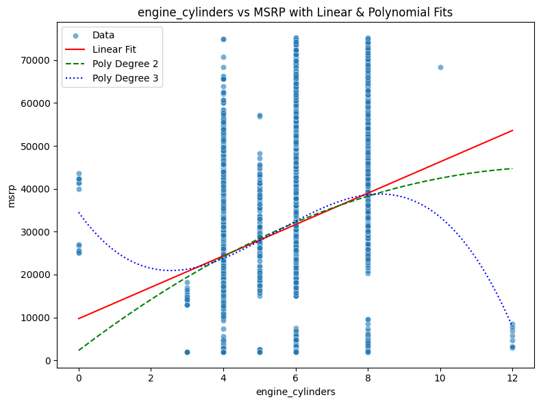
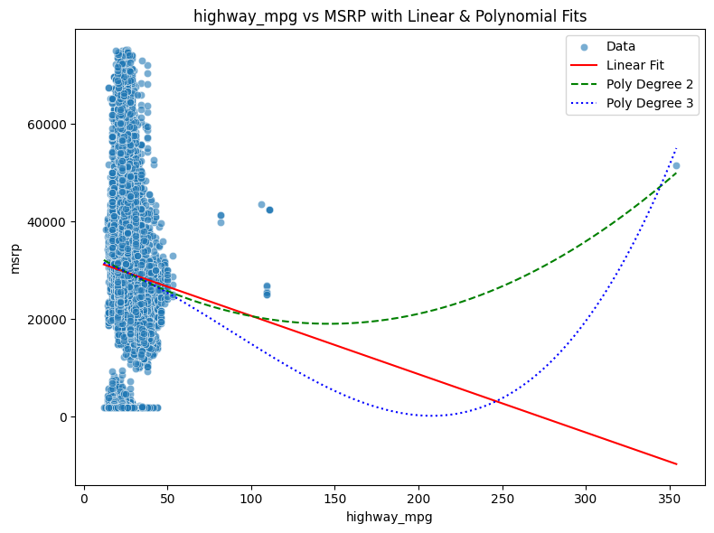
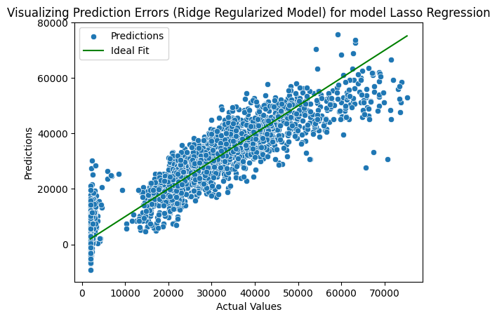
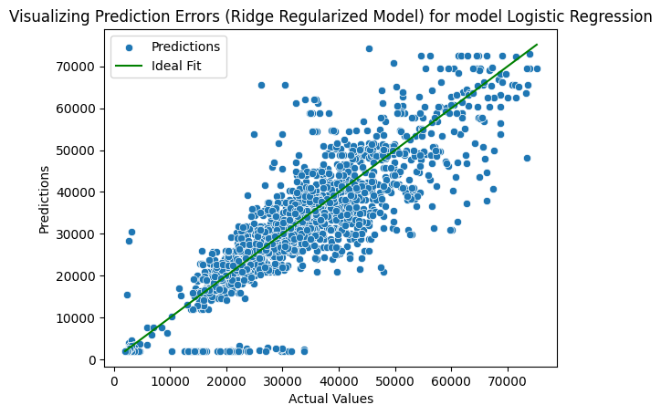
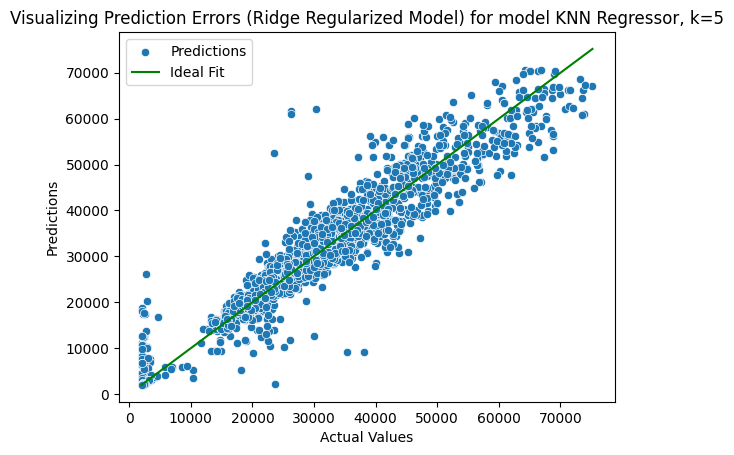

# BTL1 Machine Learning (CO3117) - Machine Learning (ML) with text Data
## *Overview and goal of this excercise*

Through all BTL, these excercises aim to apply machine learning knowledge to various data types, utilizing the traditional machine learning pipeline and the modern machine learning pipeline.

BTL1 focuses on tabular data. 

## *Group info*

+ **Semester** : 1
+ **Year** : 2025
+ **Group name** : MLP2
+ **Giảng viên hướng dẫn**: TS. Lê Thành Sách
+ **Members** : 
 
    | **MSSV** | **Full Name** | **Email** |
    |:---|:---:|:--:|
    | 2312046 | Bùi Ngọc Minh | minh.buingocbkhoa@hcmut.edu.vn |
    | 2313233 | Lê Trọng Thiện | thien.lee@hcmut.edu.vn |


## **Project structure**
The project includes 1 file in ./notebook folder containing all the code. The collab file is also available [here](https://colab.research.google.com/drive/1goaS_xxgNi6SsKrlAPgkdIduMiJ7RZDy#scrollTo=cea_BvuSOWI4)

The project also includes 1 plot folder containing all plots used in this README file.

## *Setup and run*

The collab file is set-up to be able to run-all. It automatically downloads the data and libratries during the run process.

## *Dataset* 
dataset chosen is over 10k entries of various car models' features, used to predict car prices.

The dataset is publicly available at [this kaggle link](https://www.kaggle.com/datasets/CooperUnion/cardataset/data).

## Traditional ML Pipeline
### *EDA*

#### *General info*
The dataset has 11914 entries, with 15 feature collumns. With 8 categorical columns and 8 number columns.

```python
df.info()
```

```
RangeIndex: 11914 entries, 0 to 11913
Data columns (total 16 columns):
 #   Column             Non-Null Count  Dtype  
---  ------             --------------  -----  
 0   make               11914 non-null  object 
 1   model              11914 non-null  object 
 2   year               11914 non-null  int64  
 3   engine_fuel_type   11911 non-null  object 
 4   engine_hp          11845 non-null  float64
 5   engine_cylinders   11884 non-null  float64
 6   transmission_type  11914 non-null  object 
 7   driven_wheels      11914 non-null  object 
 8   number_of_doors    11908 non-null  float64
 9   market_category    8172 non-null   object 
 10  vehicle_size       11914 non-null  object 
 11  vehicle_style      11914 non-null  object 
 12  highway_mpg        11914 non-null  int64  
 13  city_mpg           11914 non-null  int64  
 14  popularity         11914 non-null  int64  
 15  msrp               11914 non-null  int64  
dtypes: float64(3), int64(5), object(8) 
```

All of the null data is in the feature "market_category" which specifies which market the car is sold in.

```python
duplicate_rows_df = df[df.duplicated()]
print("number of duplicate rows: ", duplicate_rows_df.shape)
```

This code yields 715 duplicated values.

#### *Data distribution*
```python
df.describe().T
```
| index            | count | mean      | std       | min  | 25%   | 50%   | 75%      | max     |
| ---------------- | ----- | --------- | --------- | ---- | ----- | ----- | -------- | ------- |
| number_of_doors  | 11908 | 3.436     | 0.881     | 2    | 2     | 4     | 4        | 4       |
| engine_cylinders | 11884 | 5.629     | 1.781     | 0    | 4     | 6     | 6        | 16      |
| city_mpg         | 11914 | 19.733    | 8.988     | 7    | 16    | 18    | 22       | 137     |
| highway_mpg      | 11914 | 26.637    | 8.863     | 12   | 22    | 26    | 30       | 354     |
| engine_hp        | 11845 | 249.386   | 109.192   | 55   | 170   | 227   | 300      | 1001    |
| popularity       | 11914 | 1554.911  | 1441.855  | 2    | 549   | 1385  | 2009     | 5657    |
| year             | 11914 | 2010.384  | 7.580     | 1990 | 2007  | 2015  | 2016     | 2017    |
| msrp             | 11914 | 40594.737 | 60109.104 | 2000 | 21000 | 29995 | 42231.25 | 2065902 |

Summary:
+ The dataset has car models make from 1990 to 2017.
+ The average price for a car is 40594.737 with a lot fo variance.
+ Cars have a wide range of popularity, from 2 to 5657.
+ Most features have a lot of variance.
  
Graphing the distribution of column "msrp" yeilds: 
```python
fig1 = px.histogram(df, x="msrp", nbins=50, title="MSRP Distribution")
fig1.show()
```


The conclusions are:
+ The data is very right skewed.
+ A lot of values are from 0 - 100k.

We decided to do IRQ in the preprocessing step to remove outliers and also reduce this skew-ness.

#### *Data relationship* 

We expore the numerical features' relationship with 'msrp_log' though fitting it to a polynomial model with degree 1, 2 and 3:






The conclusions are:
+ A lot of features are non-polynomial, some of them are very skewed, like the number of doors.
+ Year and engine horse power are quite close to the polynomial, while still have a very high degree of error.

This is a heatmap showing the correlation between each variable, with 1 being very correlated.

```python
c_table = df_nums.corr()
fig4 = px.imshow(c_table, text_auto=True, color_continuous_scale='RdBu_r', title='Correlation Heatmap', width=800, height=800)
fig4.update_traces(textfont_size=9.5)
fig4.show()
```


### *Preprocessing*

Our group drops all null and duplicated entries, then apply IQR to reduces outliers in the data:

```python
Q1 = df["msrp"].quantile(0.25)
Q3 = df["msrp"].quantile(0.75)
IQR = Q3 - Q1

df = df[df["msrp"].between(Q1 - 1.5*IQR, Q3 + 1.5*IQR)]
```

This reduces the number of entries to 10146, still over 10k.

IQR also reduces skew-ness in the data:


### Train and test traditional regression models

#### *Hyper-parameters*
+ precision : Controls how the output is printed, currently 7 digits.
+ pca : n_components for PCA, currently 90%
+ test ratio : ratio of the test size, currently 20%
+ scaler : uses standard or MinMaxScaler, currently stanard

#### *Preprocessor*

The data is split into 2 parts, numeric and categorical. 
+ Numeric data is scaled using either standard scaler or min-max scaler, confurable as a hyperparameter
+ Categorical data is encoded using onehot encoder

```python
if(_scaler == "standard") :
  num_pipe = Pipeline([
      ('imputer', SimpleImputer(strategy='median')),
      ('scaler', StandardScaler())
  ])
else :
  num_pipe = Pipeline([
      ('imputer', SimpleImputer(strategy='median')),
      ('scaler', MinMaxScaler(feature_range=(0,1)))
  ])

cat_pipe = Pipeline([
    ('imputer', SimpleImputer(strategy='most_frequent')),
    ('encoder', OneHotEncoder(handle_unknown='ignore'))
])

preprocessor = ColumnTransformer([
    ('num', num_pipe, num_cols),
    ('cat', cat_pipe, cat_cols)
])
```

#### *Models*

Our group fit the data to these models:

+ Linear regression
+ Lasso regression
+ Logistic regression
+ Random forrest regression, n = 50 and 100
+ Support vector regression
+ KNN regressor, k = 5, 10, and 50

#### *Results*









| model        | train_mse    | train_r2     | test_mse   | test_r2 |
| ------------ | ------------ | ------------ | ---------- | ------- |
| Linear Regression              | 4.539609e+07 | 4.539609e+07 | 4.541036e+07 | 0.8200782  |
| Lasso Regression               | 4.539609e+07 | 4.539609e+07 | 4.541033e+07 | 0.8200783  |
| Logistic Regression            | 4.543764e+07 | 4.543764e+07 | 5.003081e+07 | 0.8017714  |
| Random Forest Regressor, n=50  | 5.11082e+06  | 5.11082e+06  | 1.589508e+07 | 0.9370216  |
| Random Forest Regressor, n=100 | 5.031674e+06 | 5.031674e+06 | 1.609901e+07 | 0.9362136  |
| Support Vector Regressor       | 2.444992e+08 | 2.444992e+08 | 2.433881e+08 | 0.03566441 |
| KNN Regressor, k=5             | 1.186902e+07 | 1.186902e+07 | 2.042296e+07 | 0.9190815  |
| KNN Regressor, k=10            | 1.743508e+07 | 1.743508e+07 | 2.193432e+07 | 0.9130934  |
| KNN Regressor, k=50            | 3.452275e+07 | 3.452275e+07 | 3.51762e+07  | 0.8606273  |

Summary
+ Random Forest (n=50) achieves the best generalization (lowest test mean squared error - MSE), even outperforming the n=100 version. This suggests more trees does not always improve test performance and could slightly overfit on this dataset.

+ KNN shows decreasing performance as k increases, which is consistent with the model becoming too smooth (high bias). k=5 is the best among the three tested.

+ Support Vector Regressor performs very poorly on this dataset, withvery low R², visibly on the graph as basically a constant, possibly due to sensitivity to hyperparameters.

+ Linear and Lasso Regression perform nearly identically, suggesting L1 regularization is not having much effect — likely because there exists too many small-contributing features.

+ Logistic Regression is not appropriate for this dataset (unsurprisingly has worse MSE and R²).

+ Random Forest models dramatically outperform linear methods — implying the target has significant non-linear relationships that tree ensembles capture well.

+ Training MSE for Random Forest is much lower than other models, which shows its capacity to fit the training data well without huge overfitting (given its strong test R²).


